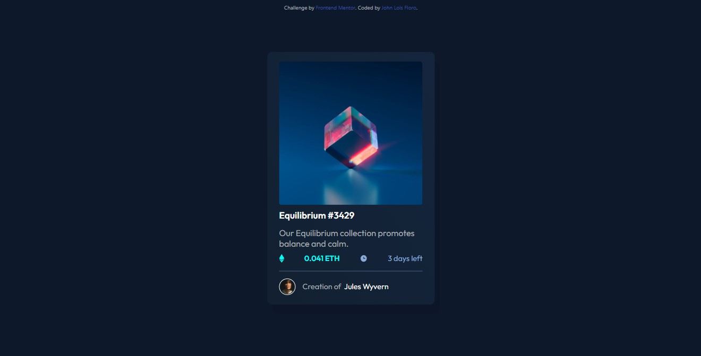

# Frontend Mentor - NFT preview card component solution

This is a solution to the [NFT preview card component challenge on Frontend Mentor](https://www.frontendmentor.io/challenges/nft-preview-card-component-SbdUL_w0U). Frontend Mentor challenges help you improve your coding skills by building realistic projects. 

## Table of contents

- [Overview](#overview)
  - [The challenge](#the-challenge)
  - [Screenshot](#screenshot)
  - [Links](#links)
- [My process](#my-process)
  - [Built with](#built-with)
  - [What I learned](#what-i-learned)
  - [Continued development](#continued-development)
  - [Useful resources](#useful-resources)
- [Author](#author)
- [Acknowledgments](#acknowledgments)

**Note: Delete this note and update the table of contents based on what sections you keep.**

## Overview

### The challenge

Users should be able to:

- View the optimal layout depending on their device's screen size
- See hover states for interactive elements

### Screenshot




### Links

- Solution URL: [Add solution URL here](https://your-solution-url.com)
- Live Site URL: [Add live site URL here](https://your-live-site-url.com)

## My process

### Built with

- Semantic HTML5 markup
- CSS custom properties
- Flexbox
- CSS Grid

### What I learned

I learned to use hover effect with an image overlay,  although it isnt perfect I'd cheated on the padding to adjust it based on the original image size. 

```css
.container__img {
    display: block;
    position: relative;
}

.container__img--orig {
    width: 300px;
    height: 300px;
    border-radius: 5px;

    display: block;
}

.container__img--overlay {
    position: absolute;
    top: 50%;
    left: 50%;
    transform: translate(-50% , -50%);
    padding: 8em;
    border-radius: 5px;
    background: rgba(0, 255, 247, 0.274);
    opacity: 0;
    transition: all 300ms ease-in-out;
}

.container__img--overlay:hover {
    opacity: 1;
    
}
```

### Continued development

The on where I want to know more is this part where the span isnt now the same as the picture. The ETH and '3 more days' , I just put justify betwwen on it. 

### Useful resources

- [CSS Image Overlay](https://www.youtube.com/watch?v=exb2ab72Xhs) - This is the link where I learned some techniques to used image overlay, but only for text. 

## Author

- Website - [John Lois Floro](https://www.your-site.com)
- Frontend Mentor - [@yourusername](https://www.frontendmentor.io/profile/loifloro)
- Twitter - [@dumb_loixx](https://www.twitter.com/@dumb_loixx)

## Acknowledgments

I made this alone, its also my first Frontend Mentor challenge. I recorded the time I started, I think I finished this in 6 hours ,is bad for beginner?
